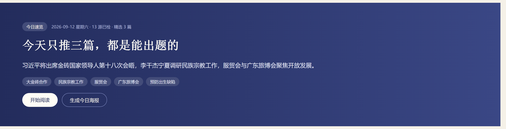
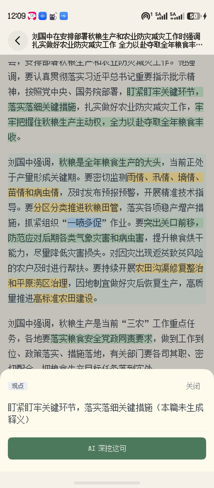
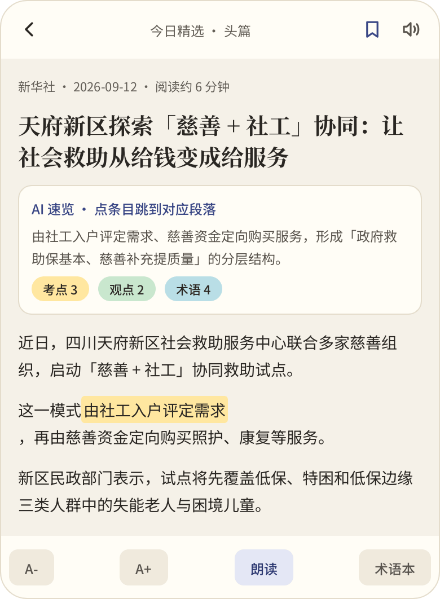
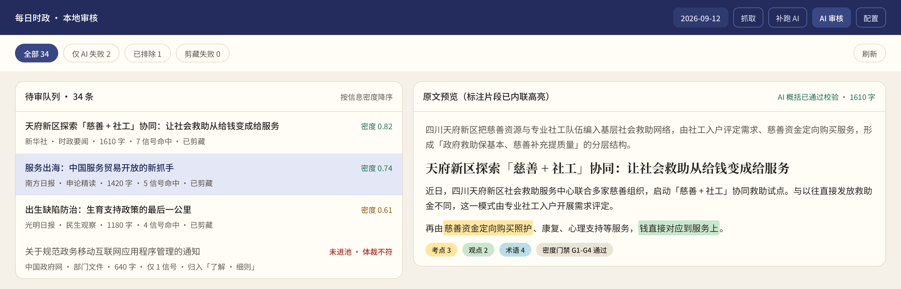
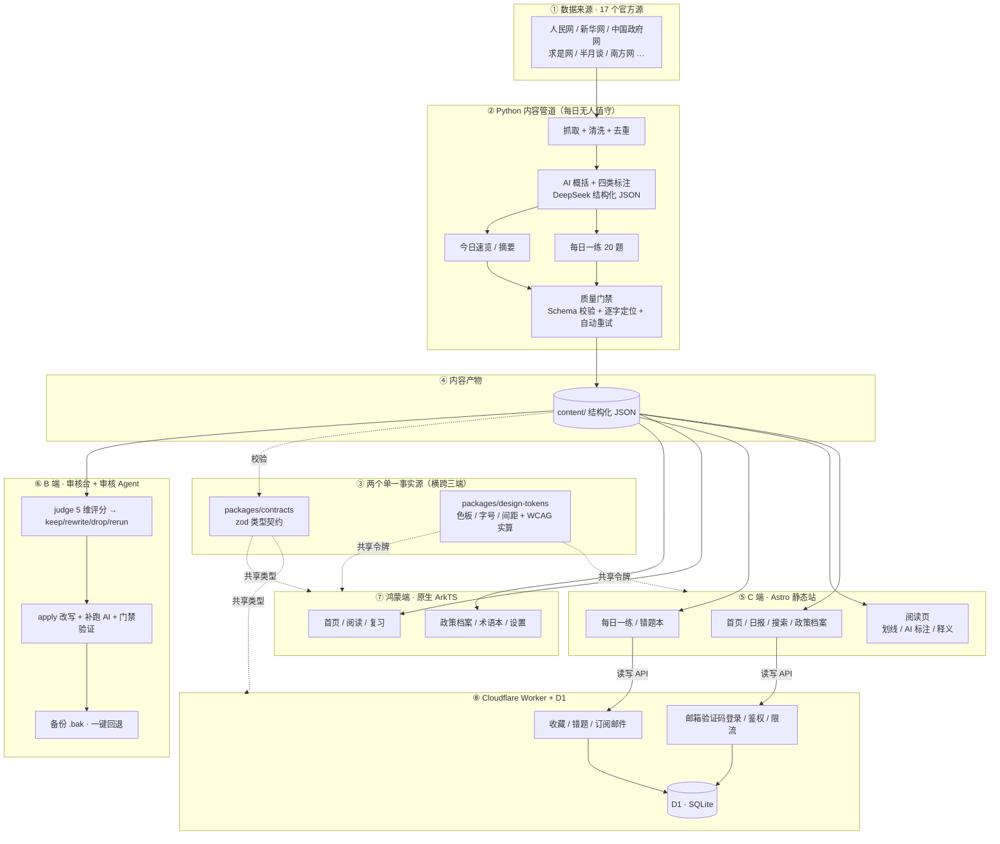

# 每日时政 · kaogong-daily

[](https://www.meirishizheng.cn)
[](LICENSE)
[](#本地验证)
[](#三个端一条流水线)

面向公务员 / 事业单位 / 申论考生的**时政 AI 阅读站**：每天聚合 17 个官方时政源，用 AI 概括、标注考点、自动出题，把考生每天筛材料的时间省掉。

**一条内容流水线，三个消费端** —— 考生读的 Web 站、运营用的审核台、以及原生鸿蒙 App。三端共享同一份类型契约与同一套设计令牌。

> **在线 Demo**：<https://www.meirishizheng.cn>

**技术要点**：Astro 静态站 + Cloudflare Worker / D1 边缘后端 · Python AI 内容管道（结构化 JSON 输出 + 原文逐字定位 + 质量门禁）· zod 三端共享契约 · 设计令牌三端共用（含 WCAG 对比度实算）· HarmonyOS 原生 ArkTS 客户端。

> **分支说明**：本仓库的 `main` 是**线上生产分支** —— 每日内容自动化与 Pages 部署都跑在它上面，因此只保留运行所需的子集。
> 本文档描述的完整公开快照（含 **HarmonyOS 原生端** `apps/harmony`、设计令牌包 `packages/design-tokens`，以及 `LICENSE` 等开源配套文件）
> 见 [`public-release`](https://github.com/YangShusen2001/kaogong-cloud-v2/tree/public-release) 分支。

---

## 三个端，一条流水线

```text
官方源(17) → Python 内容管道（抓取 / 清洗 / 去重 / AI 加工 / 质量门禁）→ 结构化内容 → 三端消费
```

### ① Web 端 · 考生阅读站（Astro 静态站）



首页**只推三篇**——「宁缺勿滥」是产品原则，不是文案。AI 每天从 17 个源里挑出真正能出题的，其余降级进「了解 · 细则」或不进池。信息密度不够的，宁可空着。

### ② 阅读页 · 四色 AI 标注（Web / 鸿蒙双端实现）

| Web 端（含释义弹层） | 鸿蒙端（原生 ArkTS） |
|---|---|
|  |  |

考点 / 观点 / 术语 / 数字指标四类标注，**每一条都必须能在原文段落里逐字定位**——定位不到的不进产物。左边是 Web 端的释义弹层与「AI 深挖这句」，右边是鸿蒙原生端：同一套设计令牌，两种完全不同的渲染栈。

### ③ 审核端 · AI 审核工作台（Python）



把人工逐篇审核升级为 Agent 工作流：**判 → 改 → 验 → 回退**。队列按「信息密度」排序而非时间，每条带信号命中数与 G1–G4 门禁状态；判定不确定的一律标记待人工，**绝不静默删除**。

---

## 架构



- 静态内容走 Astro 构建产物 → Cloudflare Pages，**读取零后端**。
- 用户数据（收藏 / 错题 / 订阅 / 会话）只通过 Hono Worker + D1 访问。
- AI 标注是只读内容数据，与用户划线**分开存储、分开渲染**。

---

## 三个跨端一致性问题，和我的解法

三端并存最大的成本不是把 UI 写三遍，是**三份「真相」会漂移**。这个项目里几乎所有工程机制都在解决同一件事。

### 1. 类型契约：zod 单一事实源

`packages/contracts` 是前端、后端、原生端共享的类型唯一源。`apps/web/test/harmony-contract-parity.test.ts` 会拿同一批样本数据同时喂给 TS 契约与鸿蒙端数据模型——**任何一侧改字段而另一侧没跟上，测试直接红**。

### 2. 设计令牌：一套色板，两种渲染栈

`packages/design-tokens/tokens.json` 是三端视觉的唯一源：`generate.mjs` 产出 Web 的 CSS 变量，鸿蒙端 `Tokens.ets` 对齐同一批值。关键是它**自带校验**——

- `test-vectors.json` + `wcag.mjs`：按相对亮度公式**实算**对比度，不靠眼睛判断；
- `scripts/audit-tokens.py`：扫三端漂移，任何一端出现硬编码色值即失败；
- `pipeline/tests/test_design_tokens.py`：在 Python 侧再验一次。

### 3. ArkTS 静态门禁：编译器不查的，自己查

鸿蒙端令牌是**方法**而非常量（为了运行时切换深浅色与字号）。漏写调用括号时，`KColor.primary` 传出去是 `() => string` 函数引用——**静态看毫无异样，只有真机编译才报**。于是写了 `apps/harmony/scripts/audit-arkts.mjs`。

而这个门禁自己也有门禁：**跑扫描前先用正负样本证明每条规则还活着**。因为正则规则一旦改了口径就会静默失效——旧规则永不命中却不报错，我们踩过一次，漏括号 bug 一路漏到了 DevEco。

---

## 工程规模

| 维度 | 数字 |
|---|---|
| 官方内容源 | 17 个（人民网 / 新华网 / 中国政府网 / 求是网 / 半月谈 / 南方网等）|
| 政策档案台账 | 21 个月 · 1175 份文件 · 1137 篇带正文 |
| 自动化测试 | 41 个测试文件（Web 3 · API 14 · 内容管道 24）|
| 架构决策记录 | 10 篇 ADR（`docs/adr/`，从选型到废弃决策都留档）|
| 任务卡 | 12 张（`docs/tasks/`，含验收标准）|
| 鸿蒙端 | 26 个 `.ets`，8 个视图组件，真机编译通过 |
| 客户端 | 3 个（Web / 审核台 / 鸿蒙原生）|

## 技术栈

| 层 | 选型 |
|---|---|
| C 端前端 | Astro + TypeScript（静态站，零运行时 JS 兜底）|
| 后端 | Cloudflare Worker：Hono + Drizzle ORM |
| 数据库 | Cloudflare D1（SQLite）|
| 内容管道 | Python（抓取 / 清洗 / 去重 / AI 概括 / 出题 / 质量门禁）|
| 审核端 | Python + 本地 Web 审核台 + 审核 Agent |
| 鸿蒙端 | HarmonyOS 原生 ArkTS（`@ohos` 应用，无 WebView）|
| 契约 | `packages/contracts`（zod 单一事实源，三端共享）|
| 设计令牌 | `packages/design-tokens`（三端共享 + WCAG 实算校验）|
| AI | DeepSeek（结构化 JSON 输出 + 原文逐字校验 + 自动重试）|
| 部署 | Cloudflare Pages / Workers + D1 |

## 快速开始

前置：Node ≥ 22 + pnpm、Python ≥ 3.12。

```sh
pnpm install

# 1) 后端：复制配置并填入自己的 D1 数据库 id
cp apps/api/wrangler.toml.example apps/api/wrangler.toml   # Windows: copy
cd apps/api && npx wrangler d1 create kaogong-db           # 创建 D1，回填 database_id
npx wrangler d1 migrations apply kaogong-db --local        # 应用迁移

# 2) 起后端（8787）与前端（4321）
cd apps/api && npx wrangler dev
cd apps/web && PUBLIC_API_BASE=http://127.0.0.1:8787 npx astro dev
```

打开 <http://localhost:4321>（仓库自带 `content/2026-08-17/` 示例内容，开箱即见效果）。

```sh
# 内容管道（需 DEEPSEEK_API_KEY）
cd pipeline && python -m venv .venv && .venv/Scripts/python -m pip install -e ".[dev]"
.venv/Scripts/python -m kaogong 2026-08-18    # 抓取并写 content/{date}/digest.json

# 审核台（Windows 双击 启动审核.bat，或）
cd pipeline && .venv/Scripts/python -m kaogong.review   # http://127.0.0.1:8321

# 鸿蒙端：用 DevEco Studio 打开 apps/harmony/ 后点 Run
```

## 本地验证

```sh
pnpm -r typecheck && pnpm -r test && pnpm -r build   # 前端 + 后端 + 契约
cd pipeline && python -m pytest -q                   # 内容管道
node apps/harmony/scripts/audit-arkts.mjs            # 鸿蒙端静态门禁
python scripts/audit-tokens.py                       # 三端设计令牌漂移
```

## 内容质量门禁

Pipeline 输出「通过」指内容产物满足发布条件（而非脚本没抛异常）：

1. JSON 通过 `content/schema/*.json` 校验。
2. AI 概括目标 80–120 字（允许 60–150），超出自动重试或标记失败。
3. AI 标注类型只能是 `viewpoint` / `exam_point` / `term` / `figure`。
4. 每个标注必须能在对应原文段落定位，`start/end` 有效、不可跨段。
5. AI 生成失败时文章仍可发布原文，但必须写入 `aiStatus` 与失败原因。
6. 内容源失败、条目异常减少或 Schema 校验失败时，流水线给出非成功质量状态，**不静默发布**。

## 工程方法论

- **ADR 先行**：影响面大的决策（架构选型、存储方案、产品方向掉头、客户端新增）先落 `docs/adr/` 再动手，含「被否决的方案与理由」。现有 10 篇。
- **任务卡驱动**：每个功能一张 `docs/tasks/` 卡，写明目标 / 验收标准 / 测试命令，完成即归档。
- **Agent 协作规范**：`docs/agents/` 定义各模块的边界与交接格式，多 agent 并行时靠文档对齐而不是靠记忆。

## 部署

见 `docs/deployment.md`（建 D1 → 迁移 → 部署 Worker → 部署 Pages）。`apps/api/wrangler.toml.example` 为配置模板。

⚠️ 顺序：**先 `d1 migrations apply --remote`，再 deploy Worker**——反了会在写新列时报 SQL 错。

## 版权与字体声明

- 仓库**不包含真实抓取内容**（`content/20*/` 已 gitignore），仅保留示例日 `content/2026-08-17/`；抓取内容版权归原作者 / 媒体，仅作示例。
- 站内自定义字体为**商用字体**，需自备授权（见 `apps/web/public/fonts/README.md`）；缺失时自动回退系统字体。

## License

[MIT](LICENSE)
