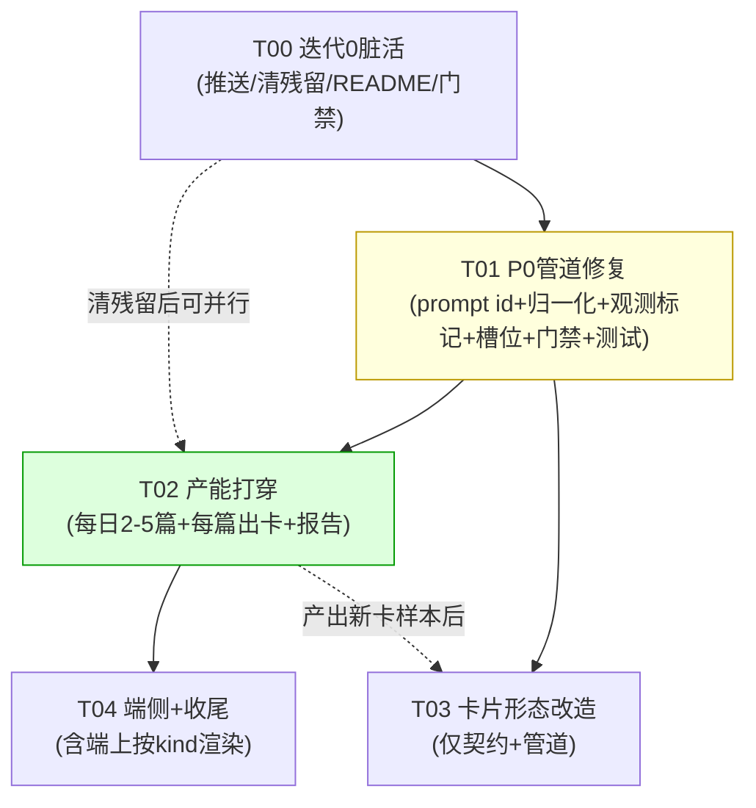
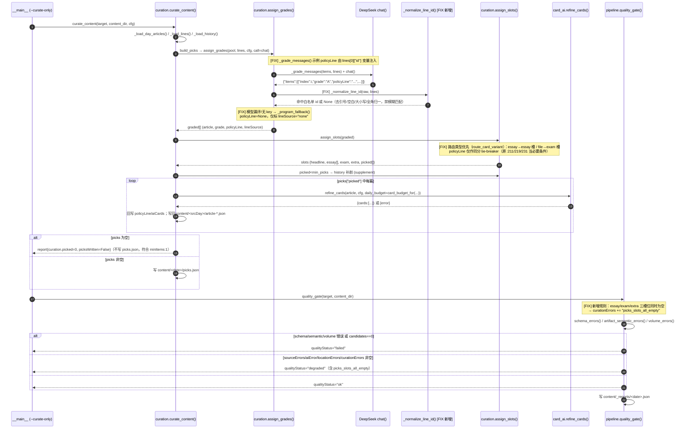
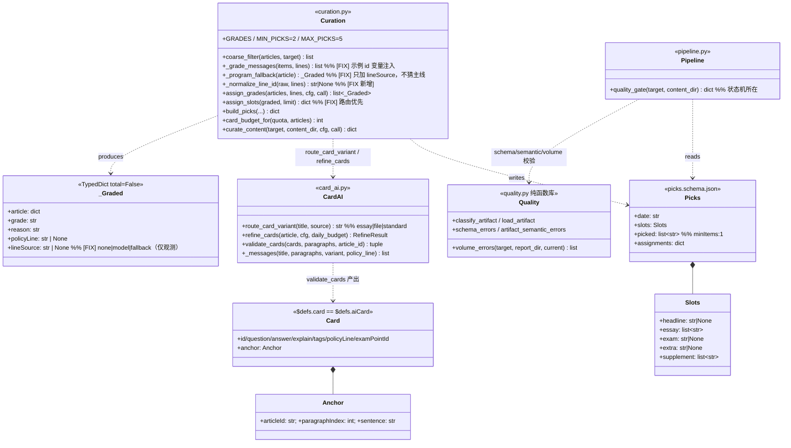

# 架构评审：下一步开发的技术评估与任务分解

> 2026-09-11 ｜ 高见远（架构师）｜输入：`docs/product/review-2026-09-11-next-steps.md`
> 方法：**所有技术判断均给出文件路径/行号依据**；对仓库现状独立复核（git / content 产物 / 源码）。
> 与产品报告不一致处**直接指出并给替代方案**。本文只诊断与设计，不改任何代码。

---

## 1. TL;DR

**技术侧最该先做的一件事：修 `curation.py:101` 的 prompt 示例 id（改为变量注入真实 id），并给 `:165` 的校验加白名单归一化（收口到 `policy-lines.json` 的 id 集合）。**

它是前置，因为这不是"一个功能"，而是**契约在接缝处断裂**（prompt 示例值 ≠ 真实数据值）：`policyLine` 100% 归 `None`
→ `assign_slots` 的 `essay`/`exam`/`extra` 三槽位**全部以 `policyLine` 非空为条件**（`:211/219/231`）→ 槽位恒空
→ picks 退化为"只有 headline + 历史补剧"→ 卡池无增量 → 端侧一切功能服务空数据源。

**我独立复核确认根因，并补两点产品报告未点透的事实：**
1. `_program_fallback()`（`:123-127`）**硬编码 `policyLine: None`**——即使修好 prompt，**模型漏评/无 key 走兜底的文章永远无主线**。但它"进不了槽位"的**真正根因是 `assign_slots` 把 `policyLine` 当必要条件**（`:211/219/231`），所以修复落在**槽位解耦主线**（§2.4 方案 c），fallback 本身**只加观测标记、不猜主线**（§2.3）。
2. 现状 `picks.json` 4 天实测（本次复算）：`essay` 恒 `[]`、`exam`/`extra` 恒 `null`，仅靠 `supplement` 凑够 `min_picks=2`。**是"空转"而非"停转"**——更危险，因为每天写出一个 schema 合法的文件。

**工时：P0 修复（T01）合计 1.5 人日** = 改代码 **0.5 天**（1a/1b/1c：prompt 示例注入 + 归一化 + `lineSource` 标记）+ 槽位解耦与门禁 **0.5 天**（1d/1e：`assign_slots` 重写 + `picks_slots_all_empty`）+ 契约测试 **0.5 天**（新增 4 个测试，见 §3）。
（T02 产能打穿 2–3 天、T03 形态改造、T04 端侧另计，不计入 P0。）

---

## 2. P0 修复方案的技术评审

### 2.1 结论先行

产品报告方向**正确但不充分**——点了两处（`:101`、`:165`），我确认都要改，但：

| 产品报告要点 | 我的判断 | 补充/修正 |
|---|---|---|
| `:101` 示例 id 改为真实 id / 变量注入 | ✅ 成立 | 必须**变量注入**而非硬编码；硬编码 `fifteen-five-plan` 会在主线池换代后复发同一 bug |
| `:165` 加归一化 | ⚠️ 成立但危险 | 归一化必须**收敛到白名单**，禁模糊匹配（§2.2） |
| `_program_fallback()` 的 `policyLine: None` | ⚠️ 需修正认知 | **只加观测标记、不猜主线**；产能恢复靠槽位解耦（§2.3） |
| 主线池只有 2 条 | ✅ 列为待拍板 | 技术推荐：**改槽位判定权重优先级，而非扩池**（§2.4） |
| 槽位填不满时加降级补位 | ⚠️ **反对** | 会掩盖真实失败（§2.5） |

### 2.2 `:101` 修法与归一化边界

`_grade_messages()`（`:86-104`）`L87` 已把真实 id 发进清单（`fifteen-five-plan(十五五规划建议)`），只有 `L101` 示例在"反着教"（用不存在的 `15w-plan`）。
**修法**：把示例 id 改为从 `lines` 动态取（`lines[0]["id"]`），让示例与清单**永远同源**。

**支持的归一化规则（保守、零误匹配）：** 去首尾空白（`:164` 已有 `.strip()`）｜去包裹引号（`"` `'` `“”` `` ` ``）｜大小写归一（id 全小写，见 `card.schema.json:13` `^[a-z0-9-]+$`）｜全角转半角｜**裁剪到白名单（仅唯一命中时接受）**。

**明确不支持（会引入误匹配）：**

| 规则 | ❌ 理由 |
|---|---|
| 子串/包含匹配 | `fifteen-five-plan` 与 `govt-work-report-2026` 可能误命中 |
| 名称模糊匹配（对 `p['name']` 相似度） | 中文阈值难定、噪声大，会把无关文章错误归属到窄主题主线 |
| 短 id 别名字典（`15w-plan→fifteen-five-plan`） | 为当前 2 条主线打补丁，换代即失效，又埋一个接缝 bug。**替代：修 prompt 源头让模型不产生短 id** |
| LLM 二次仲裁归属 | 成本 ×2、引幻觉，违背"AI 只排序不判定"边界（`:1-6`） |

**落地**：新增 `_normalize_line_id(raw, lines) -> str | None`，在 `:164-165` 调用；返回 `None` 时保留现有行为，但**必须计数**供 1.4 报告观测命中率。

### 2.3 `_program_fallback()` —— 我的判断：**只加观测标记，不猜主线**

**结论：必须加观测标记（`lineSource`），但不改变归属行为（仍返回 `None`）。产能恢复由 §2.4 的槽位解耦（1d）承担，不由本项承担。**

**现状（`:127` 硬编码 `None`）使模型漏评文章永远失去进槽位资格** —— 这个"失去资格"的根因**不是 fallback 没归属**，而是 **`assign_slots` 把 `policyLine` 当成了进槽位的必要条件**（`:211/219/231`）。所以修的地方在槽位判定，不在 fallback。

**反对两个方案：**
- **"标题关键词归属"**：误归属**比 `None` 更糟**——`None` 是"明确未知"可降级；误归属是"错误确定"，会污染 `selected_lines` 去重逻辑（`:226-229`），让 `extra` 基于错误的"已选主线"做多样性判断，产生雪崩式连锁误判。其本质正是 §2.2 拒绝的模糊匹配。
- **"仅当主线池只有 1 条时归属它"**（我上一版方案）：**在当前数据下完全不生效**——`content/policy-lines.json` 实测有 **2 条**主线（`fifteen-five-plan`、`govt-work-report-2026`），`len(lines) == 1` 恒为假，该分支永不执行 → 行为与现状**完全相同**。这是个死条件，**废弃**。

**我的方案（方案 α，零误归属）**：`_program_fallback` 继续返回 `None`，仅**新增 `lineSource: "none"` 观测标记**（`"model"`=模型归属 / `"fallback"`=兜底 / `"none"`=无归属）：

```python
def _program_fallback(article, lines=None) -> _Graded:
    ...
    return {..., "policyLine": None, "lineSource": "none"}  # 只加观测，不改归属
# assign_grades() 命中模型结果时标记 lineSource="model"
```

**然后让槽位与主线解耦**——即 §2.4 方案 (c)：槽位第一判定只看 `route_card_variant()`，`policyLine` 仅作 tie-breaker。
→ **本项（1c）不恢复产能，只提供观测；产能恢复由 1d 负责。**（避免团队误以为改了 1c 就好了）

依据：`_Graded` 是 `TypedDict(total=False)`（`:27`），加字段不破坏现有测试；`assignments` 写盘只取 `e.get("policyLine")`（`:278`），无契约破坏。
**方案 β（若坚持要给兜底文章归属）**：需按 `route_card_variant()` 做"file 类 → 唯一 file 型主线"映射，**要求主线池带类型标签——属扩池（U3）范畴，不在 P0 做**。

### 2.4 主线池只有 2 条 —— 方案对比与推荐

| 方案 | 做法 | 代价 | 风险 | 评估 |
|---|---|---|---|---|
| (a) 扩主线池到宽口径分类 | 2 条 → 8–15 条（高质量发展/统一大市场/乡村振兴…） | 低（纯数据）+ 人工维护 | 归属变松，重会审 | 可做但**非第一步** |
| (b) 降低 `policyLine` 在槽位判定中的权重 | 改 `:211/219/231` 条件 | 低（3 行） | extra 失去唯一区分度，可能"3 篇同主题" | **治标**，单用伤多样性 |
| **(c) 槽位改"路由类型优先、主线仅 tie-breaker"** ⭐ | 第一层只看 `route_card_variant()`（`card_ai.py:85`）；`policyLine` 仅同分排队用 | 中（重写 `:206-234`） | 与"考什么学什么"主线叙事弱相关，需产品确认 | **推荐** |
| (d) 砍掉槽位概念，只取 Top-N | 改法最简 | 低 | 丢"申论精读/考点提炼"产品语义，破坏 schema | 不推荐 |

**推荐 (c) 为主 + (a) 为辅（分阶段）**，依据：
1. **槽位本质是"内容类型分配"（评论/文件/兜底），非"主线分配"**。看代码 `:210` 用 `== "essay"`、`:217` 用 `== "file"`——路由类型**已经是第一判定条件**，`policyLine` 只是多余的 `and` 附加条件（`:211`）。降为 tie-breaker 是**对现有设计的收敛**，非推倒重来。
2. **实测路由有料**：产品报告用 `route_card_variant()` 跑真实标题，08-19 有 essay 4 篇 / file 4 篇——**料是够的，是 `policyLine` 把料卡死了**。故 (c) 能立刻恢复产能，(a) 是锦上添花。
3. **(b) 单用会伤多样性**：extra 的意图是"多样性补充，主线与已选不同"（`:225-231`），去约束后与 headline 职责重叠。

**分阶段**：本次（P0）实现 (c)；迭代 1.1 期间用 1.4 报告统计命中率，若仍未达产品要求再评估 (a)。
> ⚠️ **这是产品决策，需拍板**（§7 U2）：(c) 会稀释主线绑定强度。

### 2.5 "降级补位" —— 我反对

产品报告 §5 迭代 1 提到"槽位填不满时加降级策略（如 exam 空则用 file 路由最高级补位）"。**我反对**：

**它会掩盖真实选材失败**，把"没选出来"伪装成"选出来了"——正是 `AGENTS.md` 第 8 条要禁止的行为。关键在于：
- "槽位空"有两种成因：(i) 当日池**真没有**该类型文章（合法空）；(ii) 因 bug（`policyLine` 全 None）导致的**非合法空**。
- **补位会同时掩盖 (ii)**：本该报 degraded 的日期因补位后"看起来满了"被放行 → 又一次静默发布。
- 与 §2.6 门禁**目标直接冲突**：门禁要"三槽位全空 → degraded"，补位让三槽位**永远不空**，门禁永不触发。

**正确做法**：**阶段 1 不做补位**——先修 §2.2/2.3/(c)，让门禁暴露真实空槽位，用 1.4 报告测量 7 天填充率，**先测量再决定**。
**阶段 2（仅当证明"合法空"频繁）**：补位必须**带标记**——补位文章记入独立键（如 `examFallback`），**不覆写 `exam`**，报告记 `fallbackUsed: true`，使"空"与"补位"可区分、门禁仍能识别。

> 一句话：补位是**产品叙事手段**（页面丰满），不是**工程正确性手段**。工程正确性要求"空就是空，且被记录"。

### 2.6 质量门禁规则的技术设计

**规则**：`essay`/`exam`/`extra` 三槽位同时为空 → 判 `degraded` 并写失败原因。

**落在哪**：`pipeline.py:quality_gate()` 的 curation 分支（`:390-405`）。**不是 `quality.py`**——`qualityStatus` 只在 `quality_gate()`（`pipeline.py:407/409/411`）被赋值，`quality.py` 是**纯函数库**（无状态、无 `qualityStatus`）；`curation.py` 只写 `report["curation"]`。把状态机塞进 `quality.py` 会破坏其无副作用校验职责。

**`qualityStatus` 状态机（读代码确认，非猜测）：**

```
quality_gate() L406-411
  failed   ← schemaErrors/semanticErrors/volumeErrors 非空 OR sourcesOk==0 OR candidates==0
  degraded ← sourceErrors 非空 OR aiError>0 OR locationErrors>0 OR curationErrors 非空
  ok       ← 以上皆无
```
现有取值 `ok/degraded/failed`；`curationErrors` 现有值（`:392-404`）：`picks_missing`（文件不存在且 articles>0）、`picks_empty`、`picks_invalid_json`、`ai_refinement_errors`。

**新增** `picks_slots_all_empty`，加在 `:397-402` 的 else 分支（picks 文件存在时）：

```python
if not picks_data.get("picked"):
    curation_errors.append("picks_empty")
else:
    slots = picks_data.get("slots") or {}
    if not slots.get("essay") and not slots.get("exam") and not slots.get("extra"):
        curation_errors.append("picks_slots_all_empty")
```

**如何不误伤合法情况**：先看**"合法全空"理论上存在吗**——需当日池**既无 essay 路由、又无 file 路由、又无可绑主线文章**。但 `curate_content` 只在 **`picked` 非空**时才写 picks（`:437`），而 `picked` 非空意味着至少产出了 headline；一个只剩 standard 路由却还能凑够 headline 的池子概率极低（实测 08-19 有 4 essay + 4 file）。**保险设计**：把该规则做成**强异常信号而非硬失败**——判 `degraded`（非 `failed`），不阻止原文发布，与 `:388` 现有 `picks_missing` 哲学一致。即便偶发误报，代价只是"多一条 degraded 记录"，不会误停发布。

**与 `volume_errors()`（`quality.py:138`）协同**：它取最近 N=5 次 `ok/degraded` 报告的中位数，监控 `candidates`/`articles` **数量**（`:151`），只检"低于基线一半"（`:161`）。**作用域不重叠**：`volume_errors` 管**输入数量**，新规则管**输出选材质量**。
- **协同要点**：新规则产出 `degraded` 后该报告**仍进入 `volume_errors` 基线窗口**（因它取 `ok/degraded`，`:147`）——这是对的，不该因"选材失败"排除该日输入数量。
- **避免双重告警**：二者写入不同字段（`volumeErrors` vs `curationErrors`）并独立影响状态；同日两者都命中 → 取 `failed`（`:406` 优先级高），**不冲突**（`failed` 是更强信号）。
- **唯一风险**：连续 `degraded` 会让基线窗口尽为 `degraded`，稀释 `ok`——但这对数量门禁无害（基线本就该含降级日）。**结论：无需特殊处理。**

---

## 3. 契约测试方案

### 3.1 断言清单

**核心**：用真实 `_grade_messages()` 构造的 prompt，其示例 id 必须能被校验函数接受。

```python
def test_grade_prompt_sample_id_is_valid():
    msgs = _grade_messages([{"metadata": {...}}], LINES)
    m = re.search(r'"policyLine"\s*:\s*"([^"]+)"', msgs[1]["content"])
    assert m and m.group(1) in {p["id"] for p in LINES}, f"示例 id {m.group(1)} 不在真实主线池"
```

**id 形态归一化清单**（喂 `_normalize_line_id`/`assign_grades`）：

| 输入 | 期望 | 说明 |
|---|---|---|
| `fifteen-five-plan` | ✅ 归属 | 精确命中 |
| 同前（大写）/ 带引号 / 带空白 / 全角连字符 | ✅ 归属 | 大小写、去引号、strip、全角转半角 |
| `15w-plan`（不存在的短 id） | ❌ → `None` | **固化"不做别名映射"** |
| `不存在的线` | ❌ → `None` | 保持现有行为（`test_curation.py:58`） |
| `十五五规划建议`（名称） | ❌ → `None` | **不做名称模糊匹配** |

### 3.2 文件与范式

- **文件**：`pipeline/tests/test_curation.py`（追加）。已 import 相关符号（`:6`），保持内聚。
- **范式**：**注入可观察 prompt**。`assign_grades` 的 `call` 已可注入（`:135`）；关键是 stub **捕获** messages：

```python
def _observing_call(items, captured):
    def _stub(messages, _cfg, **_kw):
        captured.append(messages); return _payload(items)
    return _stub
```

### 3.3 "修复前必失败、修复后通过"

| 测试 | 修复前 | 修复后 |
|---|---|---|
| `test_grade_prompt_sample_id_is_valid` | ❌（示例是 `15w-plan`，不在 `LINES`） | ✅（动态注入真实 id） |
| `test_normalize_line_id_variants` | ❌（`_normalize_line_id` 不存在，ImportError） | ✅ |
| `test_fallback_line_source_marked` | ❌（无 `lineSource` 字段） | ✅（标记 `none/model/fallback`，**不猜主线**） |
| `test_assign_slots_route_first`（方案 c） | ❌（`policyLine=None` 时槽位仍空） | ✅ |

**CI 上先跑（红）确认测试真能捕获 bug，再改代码（绿）。禁止先改代码再补测试**（测试会"迁就"实现，无法证明有效性）。

### 3.4 是否推广 —— 按"实际存在概率 × 影响"排序（不是"一律都做"）

| 优先级 | 目标 | 理由 |
|---|---|---|
| **P0** | `curation.py`（§3.1-3.3） | 已确证线上 0% 命中，必须做 |
| **P1** | `card_ai.py` | **同类风险最高**：`_messages()`（`:117-142`）也拼 `output_shape` 示例（`:126-130`），其 `anchor.sentence` 强依赖模型逐字复制原文（`:179` `_locate`）——正是"示例 vs 真实"同类接缝。加"真实 prompt 喂 `validate_cards()`"测试 |
| **P1** | `article_ai.py` | 同族：标注 `start/end/text` 定位依赖逐字匹配。**与 `card_ai` 合并为一个测试任务** |
| **P2** | `relation_ai.py` | **不做**——该能力已于 2026-08-22 停用（`curation.py:422-423` 注释）。给停用能力补测试是低价值 |

---

## 4. 卡片形态改造的技术评估

### 4.1 "改 prompt"还是"改数据模型"？→ **两者都要，但先改契约**

依据：
1. 现有字段（`card.schema.json:22-76` / `article.schema.json:204-238`）为 `id/question/answer/explain/tags/policyLine/examPointId/anchor`——**无"适用话题/位置"字段**。prompt 若让模型输出，`validate_cards()`（`card_ai.py:149-199`）会因 `additionalProperties: false` **直接丢弃**。
2. 产品要的"素材卡三形态"（观点 ≤50 字 / 结构 动宾句 / 案例 十几字）与现有"问答式考点卡"是**不同形态**：现有 `question` 是疑问句（`card_ai.py:162` 校验 10–40 字），目标是**陈述性短语**。**卡片语义主键从 `question` 变成 `content` + 分类标签**，非加两字段能解决。
3. 顺序：**先定契约**（两处 schema 同步改）→ 改 prompt → 改校验 → 改端上模型。

### 4.2 涉及文件与契约

| 文件 | 改什么 |
|---|---|
| `content/schema/card.schema.json` | `$defs.card` 加 `kind`（观点/结构/案例）、`topic`、`position` |
| `content/schema/article.schema.json` | `$defs.aiCard`（`:204-238`）**同步改** ⚠️ 一致性测试 `_strip_defs_locations` 逐字段比对，**漏改一处必挂** |
| `pipeline/src/kaogong/card_ai.py` | `_BASE_RULES`（`:32-49`）改 prompt；`validate_cards()`（`:149-199`）按 `kind` 分支校验；`_card_id`（`:145`） |
| `apps/web/src/lib/content.ts` | `listCards()`（`:169`）+ 类型定义（**T04.4d**） |
| `apps/harmony/entry/src/main/ets/service/Review.ets` | `ReviewCard` 接口（`:22-28`）加具名字段（**T04.4d**，非 T03） |

### 4.3 存量 54 张卡 → **推荐"双轨 + 渐进淘汰"**

保留存量 54 张（标注 `kind='qa'`），新产出走新形态；端上按 `kind` 分别渲染。**理由**：
1. 存量是人工策展的高质量考点卡（`content/cards/15w-plan.json` 等），有独立价值且端上 FSRS 已在用，废弃 = 浪费已验证资产。
2. 新形态 prompt 需迭代调优（"结构类"在现有 215 篇产物里**零覆盖**，是纯增量），调优期以旧卡兜底，避免"新旧形态都很少"的空窗。
3. `kind` 字段天然支持双轨；等新卡池 ≥ 存量规模后再决定是否下架旧卡。
> ❌ 不推荐全量重生成（API 成本 + 旧卡 `anchor` 可能失效）。

### 4.4 与"提高产卡率"的先后 —— 我的技术判断

产品报告主张"形态与产卡率是两件事，形态可能更前置"。**修正：两者不可拆独立批次，但工程顺序必须是"产卡率（P0）→ 形态（随后）"。**

1. 产卡率是"管道是否工作"（`policyLine` bug → picks 塌陷 → 无卡可产）；形态是"产出的卡是否对"。**前者不修，后者无样本**。
2. 形态改造涉及**契约变更**，而契约变更会**打断 P0 修复**（同批文件 `card_ai.py`/schema），使"修复前必失败"的回归基线**不稳**。
3. 正确批次：**第一批（P0）**修管道，**不动卡片契约**；**第二批（1.2）**用**现有**形态跑通产卡率；**第三批**形态改造（此时已有稳定新卡样本可验证）。
> **"形态更前置"在逻辑上成立（产品定义确要素材卡），但工程上必须让位于"先让管道产出卡"**，否则是在"零样本"上改 prompt，无法验证。

### 4.5 涉及端上吗？→ **涉及，成本可控**

端上读 `Review.ets:22-28`（`ReviewCard` 接口）、`:342-353`（构造复习项）。**ArkTS 硬约束**：**禁无类型对象字面量**（新字段必须显式声明类型）｜**禁索引签名**（不能 `[key: string]: any`）→ 必须加**具名字段**，旧卡缺字段时按 `kind` 默认值兜底（照抄 `:352` 的 `explain === undefined ? '' : explain` 范式）。

---

## 5. 有序任务列表（5 组上限）

> 环境坑见 §5.1；需用户操作的命令见 §5.2。

### T00 · 迭代 0 脏活（账目可信化）｜P0｜无依赖｜全并行

| 目标 | 文件/操作 | 验收 | 成本 | 需用户？ |
|---|---|---|---|---|
| 0.1 推送 56 个提交 | `git push origin public-release` | `git log origin/public-release..HEAD` 为 0 | 5 min | ✅ |
| 0.2 修 release 门禁 | `docs/release-readiness.json`（`REL-NEWSLETTER-PROVIDER` 降 medium/移出；`REL-PRODUCTION-DEPLOYMENT` 补 `closeEvidence` 三字段） | `pnpm release:check` exit 0 | 0.5 天 | 部分 |
| 0.3 清 `_tmp_*` 残留 | 删根目录 3 个 `_tmp_*`（**已实测存在**） | `ls -d _tmp_*` 无输出；`pnpm -r test` 假失败清零 | 10 min | 否 |
| 0.4 修 README 失效截图 | `README.md:26,30` 引用的 `docs/screenshots/*.png`（**实测目录不存在**）→ 删引用或补图 | README 无失效引用 | 15 min | 否 |
| 0.5 预防 | `.gitignore` 加 `_tmp_*/` | 下次残留不进 `git status` | 5 min | 否 |

**风险**：0.1 是本项目**唯一归零风险**（56 提交仅在本机）。**不接受 postpone。**

### T01 · P0 管道修复（契约接缝 + 门禁 + 回归测试）｜P0｜依赖 T00.3

| 子项 | 目标 | 文件 | 验收（**每条注明修复前该测试必失败**） | 成本 |
|---|---|---|---|---|
| 1a | prompt 示例 id 变量注入 | `curation.py:86-104` | `test_grade_prompt_sample_id_is_valid` 通过（**修复前失败**：示例是 `15w-plan`） | 0.5 天 |
| 1b | 校验白名单归一化 | `curation.py` 新增 `_normalize_line_id()`，改 `:164-165` | 8 种 id 形态测试通过（**修复前失败**：函数不存在，ImportError） | （含 1a） |
| 1c | **仅加观测标记，不猜主线** | `curation.py:123-127`、`:162`（`lineSource: none/model/fallback`） | `test_fallback_line_source_marked` 通过（**修复前失败**：无该字段）。**本项不恢复产能** | （含 1a） |
| 1d | 槽位改"路由优先、主线 tie-breaker"（方案 c）——**产能恢复由本项负责** | `curation.py:179-239` | `policyLine=None` 时 essay/exam/extra **仍能填充**（**修复前失败**：槽位为空） | 0.5 天 |
| 1e | 门禁 `picks_slots_all_empty` | `pipeline.py:397-405` | 三槽位全空 → `degraded` 且 `curationErrors` 含该值（**修复前失败**：无该值） | 0.5 天 |

> **执行纪律**：新增 4 个测试**先在当前代码上跑一遍（红）**，确认能捕获 bug，再改代码让它变绿。禁止先改代码再补测试。
> **验收总标准**：`pytest pipeline/tests/test_curation.py` 全绿 且 **主线归属命中率 ≥80%**（用 1.4 报告复核）。
**风险**：1d 动 `assign_slots`，现有 `test_assign_slots_structure:66-86` 依赖旧逻辑 → **需同步改为"路由优先"语义**。

### T02 · 产能打穿（每日 2–5 篇 + 每篇出卡 + 报告）｜P0｜依赖 T01

| 子项 | 目标 | 文件 | 验收 | 成本 |
|---|---|---|---|---|
| 2a | 跑 `python -m kaogong <date> --curate-only` | `content/<date>/picks.json` | 连续 7 天存在且 `2 ≤ len(picked) ≤ 5` | 2–3 天 |
| 2b | 每篇入选必出卡 | `curation.py`（`refine_cards` 已调用） | picks 内卡覆盖 100%；卡池 54 → ≥70 | （含 2a） |
| 2c | 产能报告 | `content/_reports/<date>.json` 补"槽位填充率/兜底占比/命中率" | 每日一份，7 天趋势可读 | 0.5 天 |
| 2d | 清 `backfill_explain.py` 绕过日限 | `pipeline/src/kaogong/backfill_explain.py` | 单日卡数可断言 ≤ `DAILY_NEW_CARD_LIMIT` | 0.5 天 |

**风险**：打分/产卡质量波动 → 前 3 天人工抽检；保留"宁缺毋滥"留空机制（`card_ai.py:40`）。

### T03 · 卡片形态改造（**只做契约+管道**）｜P1｜依赖 T01（契约稳定）；**建议 T02 产出新卡样本后启动**

> **范围界定：T03 只做契约 + 管道 prompt/校验；端上改动归 T04.4d。** 避免"改了 schema 却没人渲染"。

| 子项 | 目标 | 文件 | 验收 | 成本 |
|---|---|---|---|---|
| 3a | 定契约（`kind`/`topic`/`position`） | `card.schema.json` `$defs.card` **+** `article.schema.json` `$defs.aiCard`（**逐字段一致**） | 一致性测试通过 | 0.5 天 |
| 3b | prompt 改三形态 | `card_ai.py:32-70` | 新卡含三形态；按 `kind` 校验 | 1 天 |
| 3c | 改校验 | `card_ai.py:149-199` | 长度/字段按 `kind` 分支 | （含 3b） |
| 3e | 存量 54 张双轨 | 旧卡标 `kind='qa'` | 卡池不空窗 | 0.5 天 |

### T04 · 端侧 + 收尾｜P2｜依赖 T02；**4a 可与 T02 并行**

| 子项 | 目标 | 文件 | 验收 | 成本 |
|---|---|---|---|---|
| 4a | App 首页删长列表（减项） | `HomePage.ets`（复习入口 `:443-497` **已存在**，不重做） | 首页只剩 2 区块；空态降"考点复习" | 2 天 |
| 4b | 考试倒计时 | 端上全局头部 | "距省考 N 天 / 已积累 M 张卡" | 1 天 |
| 4c | 契约测试推广 | `card_ai`/`article_ai`（**`relation_ai` 不做**） | 新测试能捕获同类接缝 bug | 1 天 |
| 4d | **端上按 `kind` 分流渲染**（承接 T03.3a 契约） | `Review.ets:22-28`；`apps/web/src/lib/content.ts` | 旧/新卡都能渲染；**ArkTS 具名字段，禁索引签名** | 1 天 |

### 5.1 环境坑（写进每个任务注意事项）

- **本机 `npx` 不可用** → 一律 `pnpm exec <bin>`。
- **Node 必须 24**：`better-sqlite3` 按 `NODE_MODULE_VERSION 137` 编译，Node 22 跑 `apps/api` 测试会 ABI 报错。
- **`pnpm install` 必须用户在自有 cmd.exe 执行**（安全护栏 `node-safe-delete-shim` 拦截 pnpm 临时目录清理）。
- 构建/部署命令前置 `NODE_OPTIONS=` 绕过批量删除护栏。
- **改完 `content/` 必须重建并部署**：`node apps/web/scripts/build-content-api.mjs` → `apps/web/public/content/*`；**端上读的是部署产物，不是仓库 `content/`**（运维纪律，非任务）。
- `content/20*/` **被 gitignore**（只白名单 `2026-08-17`）→ 卡片生成后不出现在 `git status`，**别误判为失败**。
- 策展命令需 `DEEPSEEK_API_KEY` 在 `.env.local`。
- **选不到材料时不写 `picks.json`**：写 `picked: []` 违反 `minItems:1`（`picks.schema.json:25`）→ 不落盘才符合约定。
- 卡片配额**按篇均分**（`card_budget_for`，`:339`），不可回退"先到先得"。
- **契约一致性**：`article.schema.json` `$defs.aiCard` 与 `card.schema.json` `$defs.card` 必须逐字段一致。

### 5.2 需用户执行的命令（cmd.exe，可直接复制）

```bat
cd /d D:\kaogong-cloud-v2
:: 0.1 推送 56 个提交（唯一归零风险，最优先）
git push origin public-release

:: 依赖安装（我方环境无法执行 pnpm install）
pnpm install

:: 跑 API 测试前确认 Node 版本为 24
node -v
```
> DevEco 点 Run（App 装机）+ 贴日志：**必须用户操作**（CLI 签名不可用，端侧是慢循环）。

---

## 6. 依赖图


**关键路径**：T00 → T01 → T02 → T04。T03 依赖 T01（契约稳定），**建议**等 T02 产出样本后启动。T04.4a（首页减项）可与 T02 并行。

### 6.1 关键调用时序（修复后）



### 6.2 领域模型（关键类）



---

## 7. 待明确事项（需拍板，每条给推荐）

| # | 事项 | 推荐 | 理由 |
|---|---|---|---|
| U1 | `_program_fallback` 是否改 | ⚠️ **只加 `lineSource` 观测标记，不猜主线**（原"单主线才归属"在 2 条主线数据下是死条件） | 产能恢复由槽位解耦（U2/1d）负责；不猜主线避免误归属污染去重 |
| U2 | 槽位改"路由优先、主线 tie-breaker"是否接受 | ⚠️ **技术推荐，需产品确认** | 能立刻恢复产能（08-19 有 4 essay + 4 file），但稀释主线绑定强度 |
| U3 | 主线池是否扩到宽口径 | **分阶段**：先做 U2 观察命中率 | 扩池是锦上添花，先让产能跑起来 |
| U4 | 槽位填不满是否补位 | ❌ **阶段 1 不补位** | 会掩盖真实失败、与门禁冲突（§2.5） |
| U5 | 门禁判 degraded 还是 failed | ✅ **degraded** | 与 `picks_missing` 哲学一致（不阻原文发布），避免误报停发 |
| U6 | 卡片形态改造批次位置 | **独立于 P0，T02 产出样本后启动** | 契约变更会打断 P0 修复测试基线（§4.4） |
| U7 | 存量 54 张卡处置 | ✅ **双轨保留，标 `kind='qa'`** | 人工策展资产有价值；调优期作兜底 |
| U8 | `relation_ai.py` 是否补契约测试 | ❌ **不做** | 该能力已于 2026-08-22 停用（`curation.py:422-423`） |
| U9 | `REL-NEWSLETTER-PROVIDER` 处置 | **降级 medium / 移出当前门禁** | 不在关键路径，不该阻塞主干 |

---

## 附：证据清单（全部本次实测）

| 证据 | 路径 / 命令 | 结果 |
|---|---|---|
| prompt 示例 id 与真实 id 矛盾 | `curation.py:87` vs `:101`（`15w-plan`）vs `:165`（精确匹配） | 确证 |
| 兜底硬编码无主线 | `curation.py:127` | `"policyLine": None` |
| 三槽位均依赖 policyLine | `curation.py:211/219/231` | 确证 |
| 主线池仅 2 条 | `content/policy-lines.json` | `fifteen-five-plan`/`govt-work-report-2026` |
| picks 4 天实测 | `content/2026-08-1[79]/picks.json` 等 | essay 恒 `[]`、exam/extra 恒 `null`，靠 supplement 凑数 |
| 门禁状态机 | `pipeline.py:406-411`；`:392-404` curationErrors | failed/degraded/ok |
| 门禁漏洞 | `picks.schema.json:25`（仅 `minItems:1`） | "合法但错误"文件可落盘 |
| 测试盲区 | `test_curation.py:74-86`/`:128/134` 喂手写正确 id | 无真实 prompt 喂校验 |
| `$defs` 一致性硬约束 | `article.schema.json:204-238` ↔ `card.schema.json:22-76` | 需逐字段一致 |
| 卡片无"适用话题/位置"字段 | `card.schema.json:22-76` | 确证 |
| 端上卡片模型 | `service/Review.ets:22-28`/`:342-353` | ArkTS 具名字段 |
| 未推送提交 | `git log origin/public-release..public-release` | **56** |
| `_tmp_*` 残留 | `ls -d _tmp_*` | **3 个** |
| README 失效截图 | `README.md:26,30`；`ls docs/screenshots/` | **目录不存在** |
| release blocker | `docs/release-readiness.json` | 2 个 high/open |
| 路由有料可选 | `route_card_variant()`（`card_ai.py:85`）实测 | 08-19: essay 4 / file 4 |
